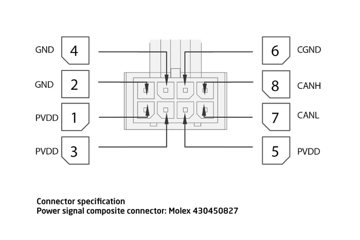

## **Parameter Diagram (mm)**

## **Parameters**
| 
**Working parameters at norminal voltage**
 | 

 |
| :-- :| :--: |
| Motor power | 500 W | 
| Norminal voltage | 42 VDC | 
| No load speed | 366.67 RPM |
| Norminal speed | 250 RPM |
| Nominal torque | 6.6 Nm |
| Peak torque | 19.8 Nm |
| Torque coefficient | 0.6 Nm/A |
| Full range of phase current | 33A |
| Nominal power current | 12 A |
| Quiescent Current | 0.08 A |

| 
**Basic parameters**
 | 

 |
| :-- :| :--: |
| Motor type | Brushless servo motor |
| Voltage range | 24~45 VDC |
| Gear ratio | 6:1 |
| Resolution | 98304 (16 bit) Step/turn |
| Encoder system | Multiturn absoulute encoder |
| Interface | Isolated CAN |
| Angle of rotation | > 360.0 ° |
| Ambient temperature range | -20~+80 °C |
| Noise level | <= 70 dB(A) |

| 
**Mechanical parameters**
 | 

 |
| :-- :| :--: |
| Diameter | 100mm |
| Length | 37mm |
| Weight | 453.1 g |
| Backlash | 9 Arc min |
| Static load capacity | 1270N |
| Version number | v3.3 |

*Note: Encoder counter range: ±127turns; Motor protection temperature settable range: 25-120 °C; Inventer protection temperature settable range: 25-120 °C*

### **Connector Pin Layout**

### **Terminal pin function**
| 
**Label**
 | 
**Signal**
 | 
**Color**
 | 
**Features**
 |
| :-- :| :--: | :-- :| :--: |
| 1 | PVDD | Black | Positive power supply |
| 3 | PVDD | Black | Positive power supply |
| 5 | PVDD | Black | Positive power supply |
| 2 | GND | Black | Power supply grounding |
| 4 | GND | Black | Power supply grounding |
| 6 | CAN-GND | Gray | CAN communication signal ground |
| 7 | CAN-L | Gray | CAN communication low signal line |
| 8 | CAN-H | Gray | CAN communication high signal line |

## **3D model**
[Download file](../download/Omni-80-6-Alpha.STEP)

