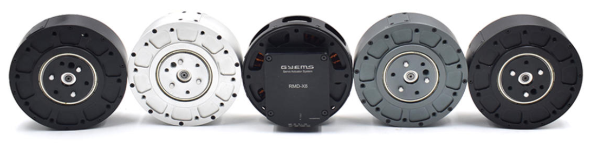

## **Installation Drawing (mm)**

## **Parameters**
| 
**Omni-80-6-Beta**
 | 

 | 

 |
| :-- :| :--: | :--: |
| Turns | T | 18 |
| Norminal voltage | V | 48 |
| No-load speed | rpm | 250 |
| Norminal speed | rpm | 165 |
| Nominal current | A | 4.9 |
| Nominal power | W | 240 |
| Nominal torque | N.M | 9 |
| Max stall current | A | 7 |
| Max stall torque | N.M | 21 |
| Resistance || 0.94 |
| Wire connect || Y |
| Phase to phase inductance | mH | 0.73 |
| Speed constant | rpm/v | 32 |
| Torque constant | N.M/A | 3.00 |
| Radial load | N | 1200 |
| Axial load | N | 300 |
| Rotor inertia | gc m^2^ | 805 |
| Number of ploe pairs || 20 |
| Motor Weight | g | 630 |
| Working temperature | °C | (-20 ~ 80°C) |
| Max demagnetize temperature | °C | 120°C |
| Reducer ratio | | 6:1 |
| Backlash | Arc min | 5 |
| Drive | | DRC20 |
| Input voltage | V | 12-50 |
| Current | A | Normal: 15A  / Instant: 30A |
| Norminal power | W | 700 |
| Communication | | CAN BUS |
| Encoder | | 16bit magnetic encoder |
| Baudrate | bps | 1M |
| Communication frequency | HZ | 2K |
| Control frequency | | Torque loop:32KHZ / Speed loop:8KHZ / Position loop:4KHZ |
| Control model || Torque loop / speed loop / position loop |
| S-Curve | | YES |
| ID switch | | YES |
| Connector | | XT2.0 |
| Temperature sensor | | YES |

## **3D model**
[Download file](../download/Omni-80-6-Beta.STEP)

