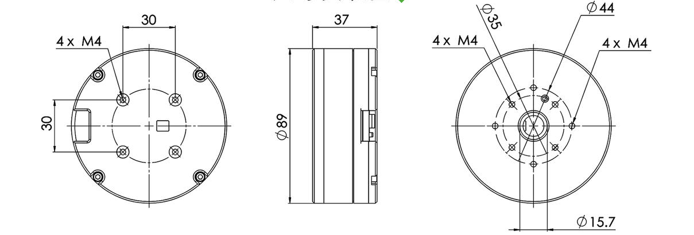

## **Installation Drawing (mm)**

## **Parameters**
| 
**Omni-90**
 | 

 | 

 |
| :-- :| :--: | :--: |
| Norminal Voltage | V | 24 |
| Nominal Current | A | 6.66 |
| Nominal Torque | N.M | 1.09 |
| Norminal Speed | rpm | 1080 |
| Max Speed | rpm | 1465 |
| Max Instant Torque | N.M |2.2 |
| Line Resistance | Ω | 0.29 |
| Wire connect || Y |
| Phase to phase inductance | mH | 0.53 |
| Speed constant | rpm/v | 61 |
| Torque constant | N.M/A | 0.15 |
| Rotor inertia | gc m^2^ | 2860 |
| Number of ploe pairs || 14 |
| Motor Weight | g | 510 |
| Working temperature | °C | (-20 ~ 80°C) |
| Max demagnetize temperature | °C | 120°C |
| Matched Drive | | DRC10 |
| Input Voltage | V | 8-36 |
| Current | A | Normal: 8A  / Instant: 15A |
| Norminal power | W | 200 |
| Communication | | RS-485/ CAN BUS |
| Encoder | | 14-bit magnetic encoder |
| Baut rate | | 9600、19200、57600、115200(default) |
| Communication frequency | | CAN BUS@1MBPS: 2KHZ; RS485@115200BPS: 500HZ |
| Control frequency | | Torque loop:24KHZ / Speed loop:8KHZ / Position loop:4KHZ |
| Control model || Torque loop(current loop) / speed loop / position loop |
| S-Curve | | YES |
| ID switch | | YES |
| Connector | | ZH1.5 / 8PIN |
| Temperature sensor | | YES |

## **3D model**
[Download file](../download/Omni-90.STEP)

