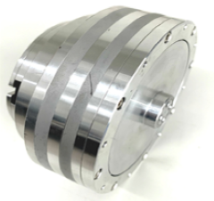

## **Parameters**
| 
**Sagittarius-80-36**
 | 

 | 

 |
| :-- :| :--: | :--: |
| Peak Torque | Nm | 216 |
| Rated Torque | Nm | 72 |
| Rated Power | W | 500 |
| Gear Ratio | | 36:1 |
| Rated Speed | rpm | 41.6 |
| Noise Level | dB(A) | <=70 |
| Backlash | Arc min | 15 |
| Torque Sensing Accuracy | R^2 | 99% |
| Dimension | mm | Φ110 x 58 (L) |
| Motor & Gear Configuration | | Serial Connection |
| Mass | g | 950 |

## **3D model**
[Download file](../download/Sagittarius-80-2436.STEP)