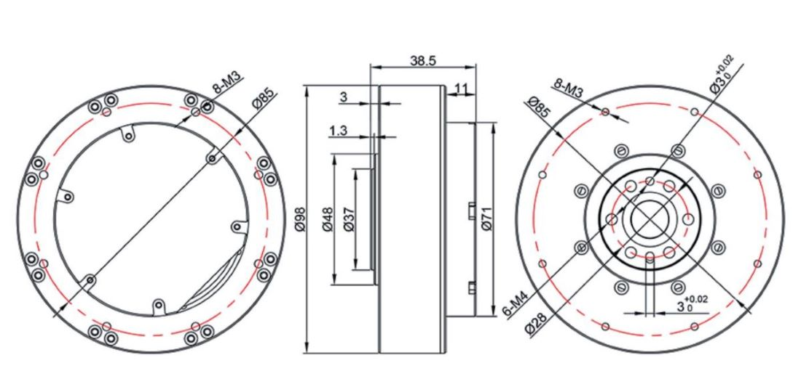

## **Installation Drawing (mm)**

## **Parameters**
| 
**Taurus-80-9**
 | 

 | 

 |
| :-- :| :--: | :--: |
| Weight | g | 485 |
| Voltage | V | 24 |
| Rated Torque | Nm | 9 |
| Peak Torque | Nm | 18 |
| Max Speed | rpm | 245(Output) |
| Rated Current | A | 12 |
| Peak Current | A | 24 |
| Kt | Nm/A | 0.091 |
| Kv | rpm/V | 100 |
| Ke | V/rpm | 0.009524 |
| Km | Nm/√w | 0.2206 |
| Number of Pole-Pair | | 21 |
| Resistance Phase to Phase | mΩ | 170±5 |
| Inductance Phase to Phase | uH | 57±10 |
| OD | mm | Φ98 |
| Height | mm | 38.5 |
| Max torque weight ratio | Nm/kg | 37 |
| Reduction ratio || 9:1 |
